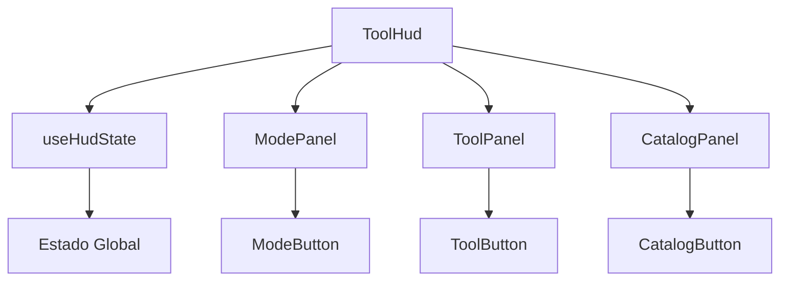

# HUD Components - Sistema de Interface 3D

## 📋 Visão Geral

O sistema HUD (Heads-Up Display) é uma interface modular e extensível para aplicações 3D, construído com React, TypeScript e Tailwind CSS. O componente principal `ToolHud` foi refatorado em subcomponentes menores e mais focados, seguindo as boas práticas do projeto e princípios de Clean Architecture.

### 🎯 Funcionalidades Principais

- **Modos de Operação**: View, Buy e Build
- **Ferramentas Contextuais**: Cada modo possui suas próprias ferramentas
- **Catálogo Condicional**: Sistema de catálogo que aparece apenas em contextos específicos
- **Estado Inteligente**: Gerenciamento automático de estado com limpeza condicional
- **Interface Responsiva**: Adaptável a diferentes tamanhos de tela

---

## 🏗️ Arquitetura do Sistema

### Estrutura de Arquivos

```
src/
├── core/types/ui/
│   └── HudTypes.ts                    # Definições de tipos TypeScript
├── shared/utils/
│   └── classNames.ts                  # Utilitário para classes condicionais
├── presentation/
│   ├── hooks/
│   │   └── useHudState.ts            # Hook de gerenciamento de estado
│   └── hud/
│       ├── constants/
│       │   └── hudConstants.ts       # Constantes e dados do sistema
│       ├── components/
│       │   ├── index.ts              # Exportações centralizadas
│       │   ├── ModeButton.tsx        # Botão individual de modo
│       │   ├── ToolButton.tsx        # Botão individual de ferramenta
│       │   ├── CatalogButton.tsx     # Botão individual de catálogo
│       │   ├── ModePanel.tsx         # Painel de seleção de modos
│       │   ├── ToolPanel.tsx         # Painel de ferramentas
│       │   └── CatalogPanel.tsx      # Painel de catálogo condicional
│       ├── ToolHud.tsx               # Componente principal
│       └── README.md                 # Esta documentação
```

### Fluxo de Dados



---

## 🧩 Componentes do Sistema

### 🎮 Componente Principal

#### `ToolHud`
**Responsabilidade**: Orquestrador principal do sistema HUD

- **Props**: Nenhuma (auto-contido)
- **Estado**: Gerenciado via `useHudState`
- **Renderização**: Composto por painéis condicionais
- **Layout**: Posicionamento fixo no canto inferior esquerdo

```tsx
// Uso básico
<ToolHud />
```

### 🎛️ Painéis de Interface

#### `ModePanel`
**Responsabilidade**: Seleção de modos de operação

- **Props**: `currentMode`, `onModeToggle`
- **Modos**: View, Buy, Build
- **Comportamento**: Toggle - fecha se já estiver ativo

#### `ToolPanel`
**Responsabilidade**: Ferramentas específicas do modo ativo

- **Props**: `mode`, `selectedKey`, `onToolSelect`
- **Condicional**: Só aparece quando há modo ativo
- **Scroll**: Horizontal para muitas ferramentas

#### `CatalogPanel` ⭐
**Responsabilidade**: Catálogo de itens para colocação

- **Props**: `items`, `selectedKey`, `onCatalogSelect`
- **Condicional**: Só aparece em `buy > place`
- **Recursos**: Preços, estados enabled/disabled

### 🔘 Botões Individuais

#### `ModeButton`
- **Função**: Alternar entre modos
- **Visual**: Ícone + label + estado ativo
- **Acessibilidade**: ARIA labels completos

#### `ToolButton`
- **Função**: Selecionar ferramentas
- **Visual**: Ícone + label compacto
- **Estados**: Ativo/inativo, hover

#### `CatalogButton`
- **Função**: Selecionar itens do catálogo
- **Visual**: Ícone + label + preço
- **Estados**: Ativo/inativo, enabled/disabled

---

## 🎣 Hook de Estado

### `useHudState`

**Responsabilidade**: Centralizar toda lógica de estado do HUD

#### Estado Gerenciado
```typescript
{
  mode: HudMode;                    // Modo ativo atual
  selected: HudSelection;           // Ferramentas selecionadas por modo
  activeSelectedKey: string | null; // Ferramenta ativa no modo atual
  catalogSelected: CatalogSelection; // Item selecionado no catálogo
  shouldShowCatalog: boolean;       // Se catálogo deve ser exibido
}
```

#### Métodos Disponíveis
```typescript
{
  toggleMode: (mode) => void;       // Alternar modo
  selectOption: (mode, key) => void; // Selecionar ferramenta
  selectCatalogItem: (key) => void; // Selecionar item do catálogo
}
```

#### Lógica Inteligente
- **Limpeza Automática**: Catálogo é limpo quando sai de `buy > place`
- **Estado Consistente**: Previne estados inválidos
- **Performance**: Computed properties para otimização

---

## 📊 Sistema de Dados

### Modos e Ferramentas

#### View Mode
```typescript
[
  { key: "persp", Icon: FiCamera, label: "persp" },
  { key: "ortho", Icon: FiGrid, label: "ortho" }
]
```

#### Buy Mode
```typescript
[
  { key: "place", Icon: PiHandDepositBold, label: "colocar" },
  { key: "move", Icon: FiMove, label: "mover" },
  { key: "eyedropper", Icon: HiMiniEyeDropper, label: "copiar" },
  { key: "sell", Icon: BiSolidBadgeDollar, label: "vender" }
]
```

#### Build Mode
```typescript
[
  { key: "wall", Icon: GiBrickWall, label: "parede" },
  { key: "floor", Icon: FaDelicious, label: "piso" },
  { key: "door", Icon: MdOutlineSensorDoor, label: "porta" },
  { key: "window", Icon: TbWindow, label: "janela" },
  { key: "bulldoze", Icon: PiBulldozerBold, label: "demolir" }
]
```

### Catálogo de Itens

#### Estrutura dos Itens
```typescript
interface HudCatalogItem {
  key: string;           // Identificador único
  Icon: IconType;        // Ícone React
  label: string;         // Nome exibido
  category: string;      // Categoria (furniture, electronics)
  tags: string[];        // Tags para busca/filtro
  price: number;         // Preço em R$
  enabled: boolean;      // Disponibilidade
}
```

#### Itens Disponíveis
- **Cadeira** - R$ 150 (furniture)
- **Mesa** - R$ 300 (furniture)
- **Sofá** - R$ 800 (furniture)
- **Cama** - R$ 1.200 (furniture)
- **TV** - R$ 2.000 (electronics, desabilitada)

---

## 🎯 Sistema de Catálogo

### Funcionalidade Condicional

O `CatalogPanel` implementa uma lógica condicional sofisticada:

#### Condições de Exibição
```typescript
// Só aparece quando TODAS as condições são verdadeiras:
mode === "buy" && selectedTool === "place"
```

#### Fluxo de Interação
1. **Usuário ativa modo "buy"** → Painel de ferramentas aparece
2. **Usuário seleciona "place"** → CatalogPanel aparece automaticamente
3. **Usuário escolhe item** → Item fica selecionado visualmente
4. **Usuário troca ferramenta** → Catálogo desaparece, seleção limpa
5. **Usuário volta para "place"** → Catálogo reaparece sem seleção

#### Gerenciamento de Estado
- **Estado Independente**: `catalogSelected` separado das ferramentas
- **Limpeza Automática**: Reset quando sai do contexto correto
- **Computed Property**: `shouldShowCatalog` determina visibilidade

---

## 🎨 Sistema de Tipos

### Tipos Principais

```typescript
// Modos disponíveis
type HudMode = "view" | "buy" | "build" | null;

// Opção de ferramenta
interface HudOption {
  key: string;
  Icon: IconType;
  label: string;
}

// Item de catálogo
interface HudCatalogItem extends HudOption {
  category: string;
  tags: string[];
  price: number;
  enabled: boolean;
}

// Estados de seleção
type HudSelection = Partial<Record<Exclude<HudMode, null>, string>>;
type CatalogSelection = string | null;
```

### Props dos Componentes

```typescript
// Painéis
interface ModePanelProps {
  currentMode: HudMode;
  onModeToggle: (mode: Exclude<HudMode, null>) => void;
}

interface ToolPanelProps {
  mode: Exclude<HudMode, null>;
  selectedKey: string | null;
  onToolSelect: (key: string) => void;
}

interface CatalogPanelProps {
  items: HudCatalogItem[];
  selectedKey: string | null;
  onCatalogSelect: (key: string) => void;
}

// Botões
interface ModeButtonProps {
  mode: Exclude<HudMode, null>;
  isActive: boolean;
  onToggle: (mode: Exclude<HudMode, null>) => void;
}

interface ToolButtonProps {
  option: HudOption;
  isActive: boolean;
  onSelect: () => void;
}

interface CatalogButtonProps {
  item: HudCatalogItem;
  isActive: boolean;
  onSelect: () => void;
}
```

---

## 🛠️ Utilitários

### `classNames.ts`
```typescript
// Utilitário para concatenar classes condicionalmente
function cn(...xs: Array<string | false | null | undefined>): string {
  return xs.filter(Boolean).join(" ");
}

// Uso
className={cn(
  "base-class",
  isActive && "active-class",
  disabled && "disabled-class"
)}
```

---

## 🚀 Extensibilidade

### Adicionando Novos Itens ao Catálogo

```typescript
// Em hudConstants.ts
export const CATALOG_ITEMS: HudCatalogItem[] = [
  // ... itens existentes
  {
    key: "new-furniture",
    Icon: NewFurnitureIcon,
    label: "Novo Móvel",
    category: "furniture",
    tags: ["new", "furniture", "modern"],
    price: 750,
    enabled: true,
  },
];
```

### Adicionando Novos Modos

1. **Atualizar tipos**:
```typescript
type HudMode = "view" | "buy" | "build" | "design" | null;
```

2. **Adicionar constantes**:
```typescript
export const MODE_LABEL = {
  // ... existentes
  design: "Design",
};

export const MODE_OPTIONS = {
  // ... existentes
  design: [
    { key: "paint", Icon: PaintIcon, label: "pintar" },
    { key: "texture", Icon: TextureIcon, label: "textura" },
  ],
};
```

### Adicionando Novos Painéis Condicionais

```typescript
// No ToolHud.tsx
const shouldShowNewPanel = useMemo(
  () => mode === "design" && activeSelectedKey === "paint",
  [mode, activeSelectedKey]
);

// No JSX
{shouldShowNewPanel && (
  <NewPanel
    items={NEW_PANEL_ITEMS}
    selectedKey={newPanelSelected}
    onSelect={handleNewPanelSelect}
  />
)}
```

---

## ✅ Padrões e Boas Práticas

### Arquitetura
- **Separação de Responsabilidades**: Cada componente tem função específica
- **Composição sobre Herança**: Componentes compostos por outros menores
- **Estado Centralizado**: Hook único para gerenciar complexidade
- **Tipagem Estrita**: Zero `any`, interfaces bem definidas

### React
- **Componentes Funcionais**: Hooks para gerenciamento de estado
- **Props Drilling Evitado**: Estado centralizado no hook
- **Memoização Inteligente**: `useMemo` para computed properties
- **Conditional Rendering**: Painéis aparecem apenas quando necessário

### TypeScript
- **Interfaces Descritivas**: Nomes claros e autodocumentados
- **Union Types**: Para estados mutuamente exclusivos
- **Generic Types**: Para reutilização de código
- **Utility Types**: `Exclude`, `Partial` para transformações

### Tailwind CSS
- **Classes Condicionais**: Via utilitário `cn()`
- **Design System**: Cores e espaçamentos consistentes
- **Responsividade**: Breakpoints para diferentes telas
- **Dark Mode**: Suporte nativo com variantes

### Acessibilidade
- **ARIA Labels**: Descrições para screen readers
- **Keyboard Navigation**: Suporte completo via Tab
- **Focus Management**: Estados visuais claros
- **Semantic HTML**: Elementos apropriados (`button`, `role="toolbar"`)

---

## 🎯 Benefícios da Implementação

### Performance
- **Renderização Condicional**: Componentes só renderizam quando necessário
- **Memoização**: Computed properties evitam recálculos
- **Bundle Splitting**: Componentes podem ser lazy-loaded
- **Tree Shaking**: Imports específicos reduzem bundle

### Manutenibilidade
- **Código Modular**: Fácil localizar e modificar funcionalidades
- **Tipagem Forte**: Erros detectados em tempo de compilação
- **Documentação**: Código autodocumentado via tipos
- **Testes**: Componentes isolados facilitam testes unitários

### Experiência do Usuário
- **Interface Intuitiva**: Fluxo natural de interação
- **Feedback Visual**: Estados claros para todas as ações
- **Performance**: Transições suaves e responsivas
- **Acessibilidade**: Usável por todos os usuários

### Experiência do Desenvolvedor
- **IntelliSense**: Autocompletar completo via TypeScript
- **Refatoração Segura**: Tipos garantem consistência
- **Debugging**: Estado centralizado facilita debug
- **Extensibilidade**: Fácil adicionar novas funcionalidades

---

## 📚 Uso e Exemplos

### Uso Básico
```tsx
import { ToolHud } from '@/presentation/hud/ToolHud';

function App() {
  return (
    <div className="relative h-screen">
      {/* Sua aplicação 3D */}
      <Canvas>
        {/* Conteúdo 3D */}
      </Canvas>
      
      {/* HUD sobreposto */}
      <ToolHud />
    </div>
  );
}
```

### Integração com Estado Global
```tsx
// Se precisar acessar estado do HUD externamente
import { useHudState } from '@/presentation/hooks/useHudState';

function ExternalComponent() {
  const { mode, activeSelectedKey, catalogSelected } = useHudState();
  
  // Usar estado para lógica externa
  useEffect(() => {
    if (mode === 'buy' && catalogSelected) {
      // Lógica para colocar item na cena 3D
      placeItemInScene(catalogSelected);
    }
  }, [mode, catalogSelected]);
}
```

---

## 🔄 Roadmap e Melhorias Futuras

### Funcionalidades Planejadas
- [ ] **Sistema de Busca**: Filtrar itens do catálogo
- [ ] **Categorias**: Organizar catálogo por categorias
- [ ] **Favoritos**: Sistema de itens favoritos
- [ ] **Histórico**: Últimos itens utilizados
- [ ] **Temas**: Suporte a múltiplos temas visuais

### Otimizações Técnicas
- [ ] **Lazy Loading**: Carregar painéis sob demanda
- [ ] **Virtual Scrolling**: Para catálogos grandes
- [ ] **Gesture Support**: Suporte a gestos touch
- [ ] **Keyboard Shortcuts**: Atalhos de teclado
- [ ] **Persistence**: Salvar preferências do usuário

### Melhorias de UX
- [ ] **Animações**: Transições mais fluidas
- [ ] **Tooltips**: Dicas contextuais
- [ ] **Drag & Drop**: Arrastar itens para cena
- [ ] **Preview**: Visualização antes de colocar
- [ ] **Undo/Redo**: Integração com sistema de comandos

---

*Documentação atualizada em: Dezembro 2024*
*Versão do Sistema: 2.0.0*